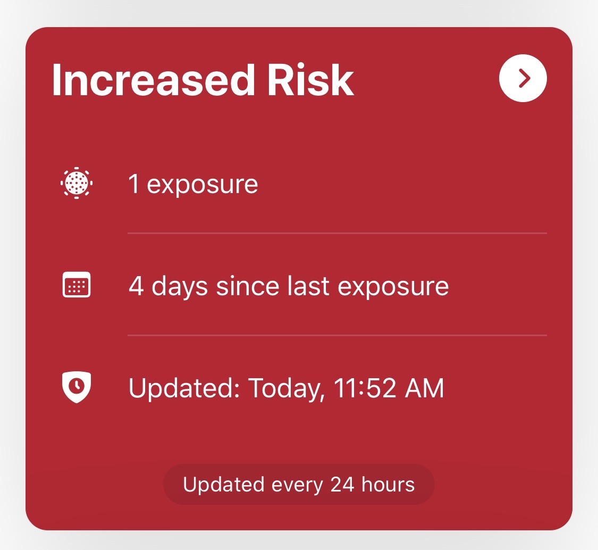

Heute Vormittag öffnete ich mehr oder weniger einfach so mal die Corona Warn App. Und ich sah den Screen, den man nicht sehen möchte. Es war wirklich Zufall, ich bekam keine Notification.

Und nun? Der Text ist in zwei Bereiche aufgeteilt: Zuerst, wie man sich (in Hamburg) zu verhalten hat und dann meine Erfahrungen und wie es ablief. Leider ist es nicht so wirklich klar, wie man sich verhalten soll und was die Konsequenzen sind. Überall stehen unterschiedliche Informationen, was sehr verwirrend ist. Ich würde diesen Text nicht schreiben, wenn alles super eindeutig sein würde.

### Der Blue Print
Am Anfang solltet ihr Menschen, mit denen ihr in letzter Zeit Kontakt hattet, informieren. Die App zeigt an, wann die Risikobegegnung war. Das hilft zur Einordnung. Eure Kontaktpersonen solltet ihr natürlich über die Gesamtsituation und das Testergebnis auf dem Laufenden halten.

Es gibt den ärztlichen Bereitschaftsdienst (116 117), auf den auch die App verweist. Dort habe ich leider keine hilfreichen Informationen erhalten. Deswegen direkt am besten bei der Corona Hotline (für Hamburg 040 428 284 000) anrufen. Dort gab man mir eine E-Mail Adresse, die ich kontaktieren sollte. Die E-Mail Adresse ist abhängig von eurem Wohngebiet, bei mir Infektionsschutz@hamburg-nord.hamburg.de. Außerdem soll man seinen Hausarzt kontaktieren.

Hausärzte sind oft in der Lage, einen Corona Test zu machen. Wenn das nicht der Fall ist (warum auch immer), fahrt zu einem der Corona Testzentren. [Hier](https://www.kvhh.net/kvhh/pages/index/p/25) sind die Testzentren für Hamburg aufgelistet. Auch wenn man kein Reiserückkehrer ist, ist das die richtige Adresse.

Für den Test im Corona Testzentrum benötigt ihr eure Maske (wichtig!), eure Versichertenkarte und natürlich in diesem Fall die Corona Warn App als Beleg.

### Und wie war es so?
Klingt jetzt erst mal relativ straight forward, war aber leider etwas komplizierter.

Als ich die App aufmachte und den roten Screen sah, war ich im Büro. Ungünstig. Also erst mal rausgegangen und angefangen zu telefonieren.

Die Corona Hotline war tatsächlich sehr hilfreich; mein Hausarzt hatte zu dem Zeitpunkt (Mittagszeit) leider keine telefonische Sprechstunde. Also Kollegen informiert, nach Hause gefahren, Freunde informiert und gewartet, bis mein Arzt wieder telefonische Sprechstunde hat.

Obwohl schon längst die telefonische Sprechstunde wieder hätte besetzt sein sollen, war mein Hausarzt nicht erreichbar. Meine Mum ist hingefahren, um zu fragen, was los sei und wie ich mich verhalten soll. Ein Test sei nicht so einfach machbar und müsste auch selbst bezahlt werden.  [Hm](https://www.youtube.com/watch?v=10Vte006Spw).

Als meine Mum mir das am Telefon erzählte, kam die E-Mail vom Bezirksamt Hamburg Nord rein. Ich solle zu einem Testzentrum fahren, falls mein Hausarzt den Test nicht machen würde. Easy! Direkt hingefahren. Man benötigt auch keinen Termin.

Turns out, die Testzentren sind sehr auf Reiserückkehrer fokussiert. Ich sagte, dass ich kein Reiserückkehrer bin, aber meine Corona Warn App ein erhöhtes Risiko anzeigt. Zuerst sagte man mir, dass ich ab 19:00 zu der Notfallpraxis gehen könnte und dort ggf. einen Test bekommen würde. Außerdem fragte man mich nach Symptomen, die ich aktuell nicht habe.

Ich machte deutlich, dass ich explizit vom Bezirksamt hierher geschickt wurde. Mir wurde gesagt, dass es sein könnte, dass ich den Test privat zahlen müsste, weil ich kein Reiserückkehrer sei. Daraufhin zeigte ich noch mal die Corona Warn App und die Mail vom Bezirksamt. Neben der Arzthelferin bekam dies auch der Arzt mit und schaltete sich ein. Dieser verwies auf eine Tabelle, die aushing. Dort stand auch klar, dass bei der Corona Warn App die Testzentren zuständig seien. So! Es lohnt sich also, hartnäckig zu bleiben.

Dann wurde ich endlich getestet. Der Test ist etwas unangenehm, aber überhaupt nicht schlimm. Das Test Ergebnis kommt dann wohl in 2-3 Tagen.

Alles in allem etwas unkoordiniert. Vom Checken der App bis zum Test hat es ca. 5 Stunden und ein paar Telefonate und E-Mails gebraucht. Ich hätte gedacht, dass nach ein paar Monaten Pandemie und Corona Warn App die Prozesse klarer und besser definiert sind. Anyway: Generell waren alle nett, hilfsbereit und bemüht, das richtige zu tun. Trotzdem ist an vielen Ecken und Enden noch viel Verbesserungspotential.