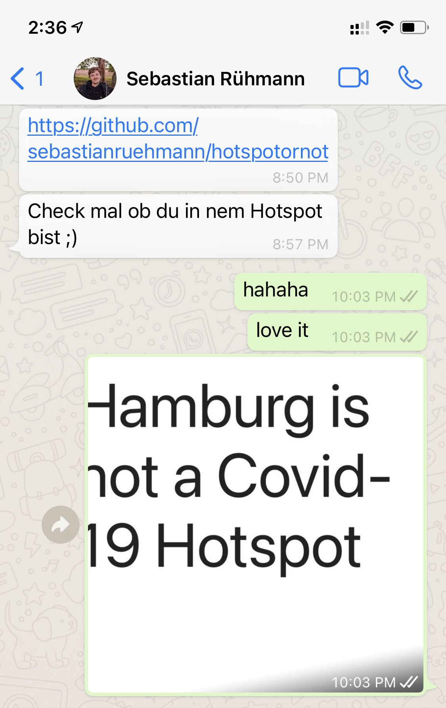
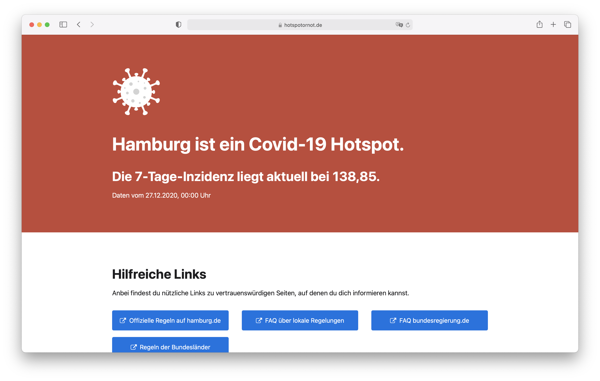
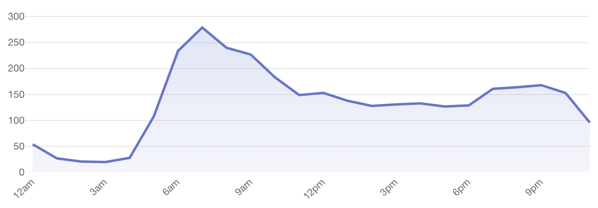

On October, 15th [Sebastian](https://seb.astian.eu/) texted me that he built a little website to check whether you are in a Corona hotspot. Compared to the numbers today, the situation was still okay. Hamburg was not a hotspot back then. [Julian](https://julianblohm.vercel.app/) and I joined the project and we worked on it together via Discord.

Depending on whether you were in a hotspot or not, there were different rules in place. **It was important to know whether you were in a hotspot or not.** The idea was to have different levels for the incidence value. Below an incidence value of 25, the page would just be green for your location. Below 35, it would be orange. Above 50, it would be red.

### Social media hype

We thought, we would just post it on social media, so maybe a few people would use it. But.. it [just went viral (Kendrick voice)](https://youtu.be/tvTRZJ-4EyI?t=53). [My tweet](https://twitter.com/jonicious/status/1318640667921424384?s=21) was one of the more successful ones for me personally but there was [another tweet](https://twitter.com/kriegundfreitag/status/1319242574998228992?s=21) really helping us.

<Tweet tweetLink="https://twitter.com/kriegundfreitag/status/1319242574998228992?s=21" />

Because of this tweet, many people visited the site. They also replied to the tweet with a screenshot including their incidence value. Many also began sharing screenshots with the link to our website.

[Sebastian](https://seb.astian.eu/) asked me to also post it on LinkedIn. First, I was not sure but [the post](https://www.linkedin.com/posts/jonas-reitmann-5aa92a15a_bin-ich-in-einem-hotspot-activity-6724414238628155392-nj53/) has more reach than my tweet and is still my most successful post to date on LinkedIn with over **5.300 views** and many reactions, comments and reshares.

---

After a couple of days, things went back to normal. Nowadays, we are at around **2.000 visitors a day**. Most of our visitors are direct traffic and probably recurring visitors. Google is our top referrer, probably because people google "Hotspot or not".

We think, "Hotspot or not?" is kind of successful because it focuses on just two things:
* What is the incidence value for an area ("Landkreis")?
* What are the rules in place?

There are so many websites that show this kind of information but they also show many more information that might not be relevant for everyone. People are looking for simple answers for their questions.

Also, sometimes it is hard to find information for your specific area ("Landkreis"). We gather useful links and rules and show them to the user in a simple way.

---

Initially, "Hotspot or not?" always relied on your browser location. Our guess was that this would be the preferred option, especially as we expected many mobile users. This would be most convenient way, right? We thought, that we would add a little input as a fallback, so people would be able to enter a location manually as well.

**To our surprise, only 19,6% of searches come through the location button.** 81,4% come from the input and enter a location manually. Obviously, the numbers here could be a bit misleading as a user can just use the location button for one location but the input for many, so this might be the reason. However, one of the key learnings of this project was to always offer two ways of locating a user.

It seems like "Hotspot or not?" is one of the first sites people browse in the morning. And people tend to sleep longer on weekends. On weekdays, our peak is roughly at 7am. On weekends however, our peak is at 9am.

### Facts

* On our first day (21.10.), we had **5.418 unique visitors**
* Our most successful day was the day after launch (22.10) with **18.541 unique visitors**
* In the first seven days after launch, we had **90.111 unique visitors**
* 89% of our visitors visit us using a phone, 4% a desktop computer, 4% a laptop and 2% a tablet
* 38% of our visitors use Chrome, 35% Safari, 12% Samsung Browser, 3% "Mobile App" (whatever this is)
* 56% of our visitors use Android, 36% iOS, 5% Windows, 3% Mac
* Users roughly spend one minute on the site
* Every day, "Hotspot or not?" is used for ~270 different areas ("Landkreise")
* [Even the Federal Ministry of Health likes it](https://twitter.com/jonicious/status/1342430532878131200?s=21)
* We do not know how many visitors the website had in total because for some time we stopped paying for analytics

### How it was built

[Sebastian](https://seb.astian.eu/) did all the initial work, so most props go to him. "Hotspot or not?" is built using [Next.js](https://nextjs.org/). Besides that, it is really nothing special and rather simple:

* [axios](https://github.com/axios/axios) (for HTTP calls)
* [React Query](https://react-query.tanstack.com/) (for server state management)
* [styled-components](https://styled-components.com/) (for styling)
* [Plausible](https://plausible.io/) (for tracking)

"Hotspot or not?" uses the official RKI data to show the incidence value. To get this data, we use the [ArcGIS API](https://services7.arcgis.com/mOBPykOjAyBO2ZKk/arcgis/rest/services/RKI_Landkreisdaten/FeatureServer/0/query). The API accepts latitude and longitude as request parameters.

There are two ways of entering your locations. Either the browser can locate you by pressing the "Lass dich orten" button. We would get coordinates from the browser, so we can send them straight to the API and show the result.

The other way is to enter a location manually. The nice thing here is that this can be a city, an area ("Landkreis") or even a zipcode. We use the [OpenStreetMap API](https://www.openstreetmap.org/) for reverse geocoding. We send whatever the user entered and get back latitude and longitude. Once we received the coordinates, we can proceed as in the flow above.

If you want to have a closer look, feel free to check out the [code on GitHub](https://github.com/sebastianruehmann/hotspotornot). We also received some contributions, so thanks for this! If you want to improve something, please feel free to let us know and/or open a pull request.

---

At the moment, basically whole Germany is a hotspot. It really surprised us that people still use "Hotspot or not?". We think that this is due to its simplicity and how we show the incidence value. As the incidence value is hopefully going down again, "Hotspot or not?" might be more relevant in the future again as rules might be different for areas ("Landkreise") based on the incidence value.
