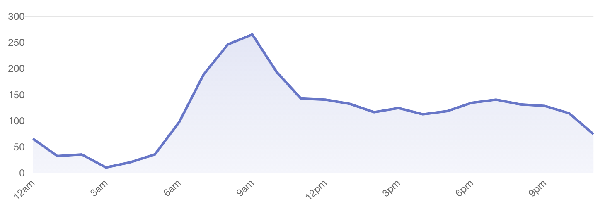

On October, 15th [Sebastian](https://seb.astian.eu/) texted me that he built a little website to check whether you are in a Corona hotspot. Compared to the numbers today, the situation was still okay. Hamburg was not a hotspot back then.

Dependent on whether you were in a hotspot or not, there were different rules in place. **It was important to know whether you were in a hotspot or not.** The idea was to have different levels for the incidence value. Below an incidence value of 25, the page would just be green for your location. Below 35, it would be orange. Above 50, it would be red.

### Social media

We thought, we would just post it on social media, so maybe a few people would use it. But.. it [just went viral (Kendrick voice)](https://youtu.be/tvTRZJ-4EyI?t=53). [My tweet](https://twitter.com/jonicious/status/1318640667921424384?s=21) was one of the more successful ones for me personally but there was [another tweet](https://twitter.com/kriegundfreitag/status/1319242574998228992?s=21) really helping us.

<Tweet tweetLink="https://twitter.com/kriegundfreitag/status/1319242574998228992?s=21" />

Sebastian asked me to also post it on LinkedIn. First, I was not sure but [the post](https://www.linkedin.com/posts/jonas-reitmann-5aa92a15a_bin-ich-in-einem-hotspot-activity-6724414238628155392-nj53/) has more reach than my tweet and is still my most successful post to date on LinkedIn with over 5.300 views and many reactions, comments and reshares.

### Things that were interesting to us

Initially, "Hotspot or not?" always relied on your browser location. Our guess was that this would be the preferred option, especially as we expected many mobile users. This would be most convenient way, right? We thought, that we would add a little input as a fallback, so people would be able to enter a location manually as well.

**To our surprise, only 19,6% use the location button.** 81,4% use the input and enter a location manually. Obviously, the numbers here could be a bit misleading as a user can just use the location button for one location but the input for many, so this might be the reason. However, one of the key learnings of this project was to always offer two ways of locating a user.

It seems like "Hotspot or not?" is one of the first sites people browse in the morning. And people tend to sleep longer on weekends. On weekdays, our peak is roughly at 7am. On weekends however, our peak is at 9am.

### Facts

* We do not know how many visitors the website had in total because for some time we stopped paying for analytics
* On our first day (21.10.), we had 5.418 unique visitors
* Our most successful day was the day after launch (22.10) with 18.541 unique visitors
* In the first seven days after launch, we had 90.111 unique visitors
* 89% of our visitors visit us using a phone, 4% a desktop computer, 4% a laptop and 2% a tablet
* 38% of our visitors use Chrome, 35% Safari, 12% Samsung Browser, 3% "Mobile App" (whatever this is)
* As of writing this, "Hotspot or not?" was used to show information for 99 locations (Landkreise) in the last seven days with Regensburg being the most popular one followed by Munich and Hamburg
* Das auf Tag
* Users roughly spend one minute on the site

### What.

The Federal Ministry of Health created a website called ["Zusammen gegen Corona"](https://www.zusammengegencorona.de/) (Together against Corona) and recommends "Hotspot or not?". Crazy!

